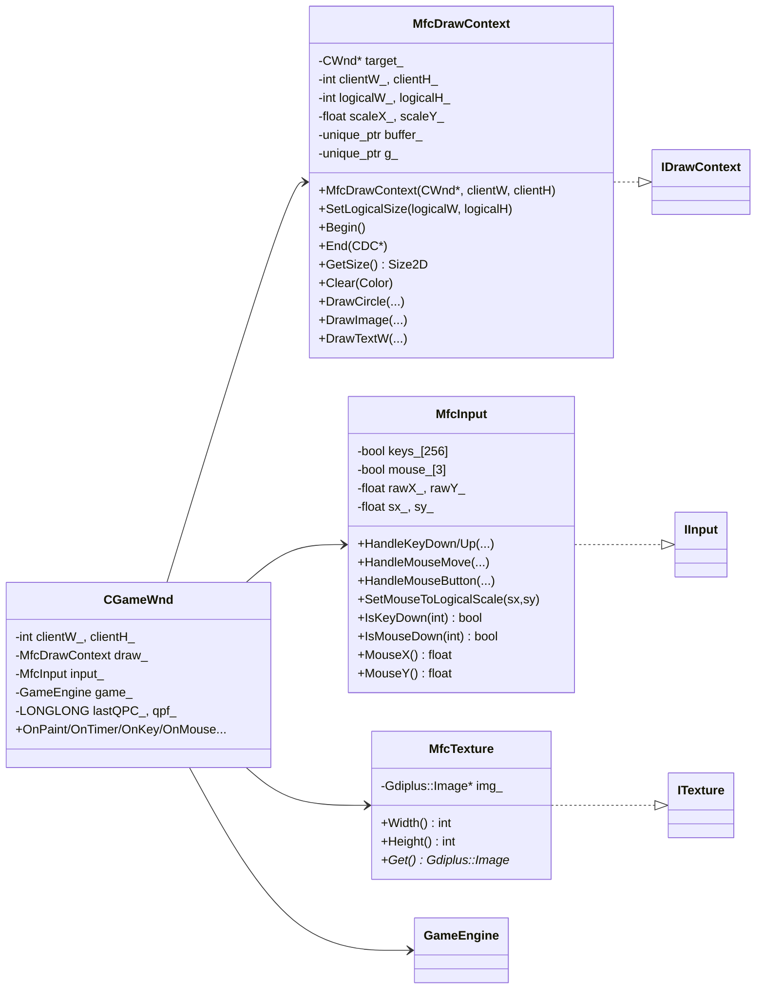
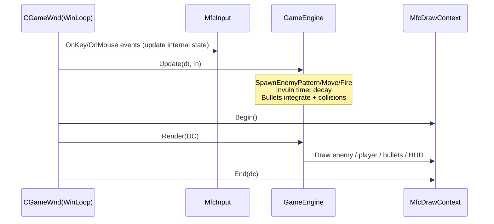

# Architecture and Diagrams

This document provides a high-level architecture overview and class diagrams for the Touhou-like minimal sample. It is intended as a reference for further development and porting.

## Key Design Points

- Engine (platform-agnostic):
  - Fixed logical coordinate space (default 800x600).
  - GameEngine owns gameplay state and logic; renders via IDrawContext and reads inputs via IInput.
  - Entities (player/enemy) have textures, circular hitboxes; bullets are simple structs with behavior driven by BulletType.
- Platform layer (MFC + GDI+):
  - Implements interfaces (ITexture, IDrawContext, IInput).
  - Handles windowing, double-buffer drawing, scaling logical→pixel coordinates, and input event translation.

## Component Diagram

```mermaid
flowchart LR
  subgraph Engine (agnostic)
    GameEngine ---|uses| IDrawContext
    GameEngine ---|uses| IInput
    GameEngine --- Bullet
    GameEngine --- Entity
    GameEngine --- GameConfig
  end

  subgraph Platform (MFC + GDI+)
    MfcDrawContext:::impl --> IDrawContext
    MfcInput:::impl --> IInput
    MfcTexture:::impl --> ITexture
    CGameWnd --> MfcDrawContext
    CGameWnd --> MfcInput
    CGameWnd --> GameEngine
  end

  classDef impl fill:#eef,stroke:#99f,color:#000;
```

## Class Diagram (Engine)

```mermaid
classDiagram
  direction LR

  class GameConfig {
    +int width = 800
    +int height = 600
    +float playerSpeed = 240
    +float playerSlowMul = 0.45
    +float enemySpeed = 40
    +int playerInitHP = 5
    +int enemyInitHP = 50
  }

  class Vec2 {
    +float x
    +float y
    +normalized() Vec2
    +length() float
    +operator+/-/*///...
  }

  class Color {
    +uint8 r,g,b,a
    +static helpers (Black/White/...)
  }

  class ITexture {
    <<interface>>
    +Width() int
    +Height() int
  }

  class IDrawContext {
    <<interface>>
    +GetSize() Size2D
    +Clear(Color)
    +DrawCircle(x,y,r,fill,border,borderWidth)
    +DrawImage(ITexture*, x,y, scale)
    +DrawTextW(text, x,y, color, alignFlags)
  }

  class IInput {
    <<interface>>
    +IsKeyDown(vk:int) bool
    +IsMouseDown(button:int) bool
    +MouseX() float
    +MouseY() float
  }

  class Bullet {
    +Vec2 pos
    +Vec2 vel
    +float speed
    +float radius
    +Color color
    +bool fromPlayer
    +BulletType type
    +Vec2  baseDir
    +float sinAmp
    +float sinFreq
    +float t
    +float turnRateRad
    +bool alive
  }

  class Entity {
    +Vec2 pos
    +float radius
    +int   hp
    +ITexture* texture
    +float drawScale
  }

  enum BulletType {
    StraightFixed
    SinWaveFixed
    AimedAtCreation
    HomingRealtime
  }

  class GameEngine {
    -GameConfig cfg_
    -Entity player_
    -Entity enemy_
    -vector<Bullet> bullets_
    -float fireCooldown_
    -float enemyPatternTimer_
    -float enemyMoveTimer_
    -bool gameOver_
    -bool win_
    -float playerInvulnTimer_
    -- (helpers) --
    -ClampToBounds(...)
    -SpawnPlayerBullets()
    -SpawnEnemyPattern(dt)
    -UpdateBullets(dt,input)
    -CheckCollisions()
    -KillOutside(Bullet&)
    +GameEngine(cfg:GameConfig)
    +SetTextures(playerTex, enemyTex)
    +Update(dt:float, input:IInput&)
    +Render(dc:IDrawContext&)
  }

  GameEngine --> GameConfig
  GameEngine --> Entity
  GameEngine --> Bullet
  GameEngine ..> IDrawContext
  GameEngine ..> IInput
  Bullet --> BulletType
```

## Class Diagram (Platform/MFC)



## Frame Update Sequence



## Coordinate System and Scaling

- Logical space: top-left origin, X right, Y down; defaults 800x600.
- MFC client window (pixel space) can be larger (e.g., 1200x900). MfcDrawContext scales logical → pixel for drawing; MfcInput maps pixel mouse → logical coordinates.
- IDrawContext::GetSize returns logical size; all engine math uses logical units (px) and seconds.

## Damage and Invulnerability

- Circle-circle collision for bullets vs entities.
- Player invulnerability: 3.0s after hit; during invuln, additional hits are ignored; a subtle halo is rendered around the player.
